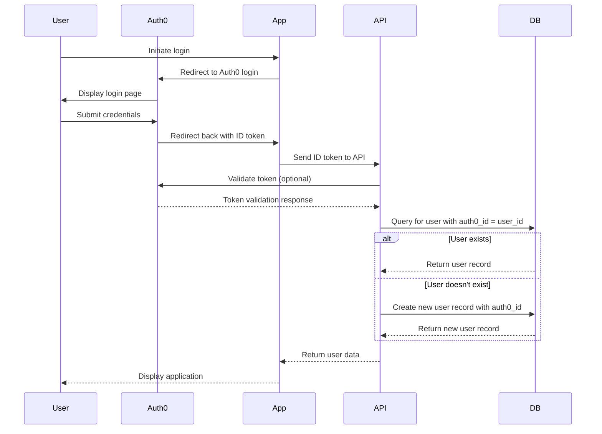

# Tens Application

This is a full-stack application with:
- Client frontend built with Next.js and TypeScript
- Backend API built with Express and TypeScript
- PostgreSQL database
- Redis cache

## Project Structure

```
.
├── backend/          # Express TypeScript API
│   ├── src/          # Source code
│   │   ├── db/       # Database layer with Prisma
│   │   └── index.ts  # Main server file
│   ├── prisma/       # Prisma schema and migrations
│   └── package.json  # Backend dependencies
├── client/           # Client frontend (Next.js)
├── docker-compose.yml # Docker services configuration
└── Makefile          # Build and deployment commands
```

## Getting Started

1. **Install dependencies:**
   ```bash
   make install-deps
   ```

2. **Start the database and cache services:**
   ```bash
   make start
   ```

3. **Run database migrations:**
   ```bash
   make migrate-dev
   ```

4. **Set up Auth0 configuration:**
   ```bash
   make client-env-setup
   ```
   This will create a `.env.local` file in the client directory with Auth0 configuration. You'll need to update the placeholder values with your actual Auth0 credentials.

5. **Start the backend:**
   ```bash
   make backend-dev
   ```

6. **Start the client frontend:**
   ```bash
   make client-dev
   ```

## Available Commands

- `make setup` - Set up the entire application
- `make start` - Start all services
- `make stop` - Stop all services
- `make backend-dev` - Start backend in development mode
- `make client-dev` - Start client in development mode
- `make client-env-setup` - Set up client environment with Auth0 configuration
- `make migrate-dev` - Run database migrations for development
- `make generate` - Generate Prisma client
- `make reset-db` - Reset the database
- `make logs` - View logs for all services
- `make clean` - Stop and remove all containers

## Services

- **PostgreSQL**: localhost:5432
- **Redis**: localhost:6379
- **Backend API**: localhost:8000
- **Client Frontend**: localhost:3001

## Auth0 Setup

To set up Auth0 authentication:

1. Create an Auth0 account at [auth0.com](https://auth0.com/)
2. Create a new application in your Auth0 dashboard
3. Configure the application settings:
   - Application Type: Regular Web Application
   - Allowed Callback URLs: http://localhost:3001/api/auth/callback
   - Allowed Logout URLs: http://localhost:3001
   - Allowed Web Origins: http://localhost:3001

4. Run the client environment setup:
   ```bash
   make client-env-setup
   ```

5. Update the `.env.local` file in the `client` directory with your Auth0 credentials:
   - `AUTH0_ISSUER_BASE_URL`: Your Auth0 domain (e.g., https://your-domain.auth0.com)
   - `AUTH0_CLIENT_ID`: Your Auth0 application client ID
   - `AUTH0_CLIENT_SECRET`: Your Auth0 application client secret

## Auth Workflow



## Secret Management

This repository has several measures in place to prevent secrets from being committed to the repository:

1. **.gitignore**: The repository includes patterns to ignore common secret files like `.env`, `*.key`, `id_rsa`, etc.

2. **Pre-commit Hook**: A pre-commit hook is installed locally to scan for potential secrets in staged files before committing.

3. **Setup Script**: A script is provided at `scripts/setup-hooks.sh` to automatically install the pre-commit hook for new developers.

4. **Best Practices**:
   - Never commit actual secrets to the repository
   - Use environment variables for configuration
   - Store secrets in a secure vault or secret management system
   - Use `.env.example` files to document required environment variables without including actual values

5. **For Contributors**:
   - Run `scripts/setup-hooks.sh` to install the pre-commit hook
   - The pre-commit hook will warn you if potential secrets are detected
   - If you see a warning, please review the file and remove or properly secure any sensitive information
   - You can bypass the check with `git commit --no-verify` but only if you're certain it's safe to do so

